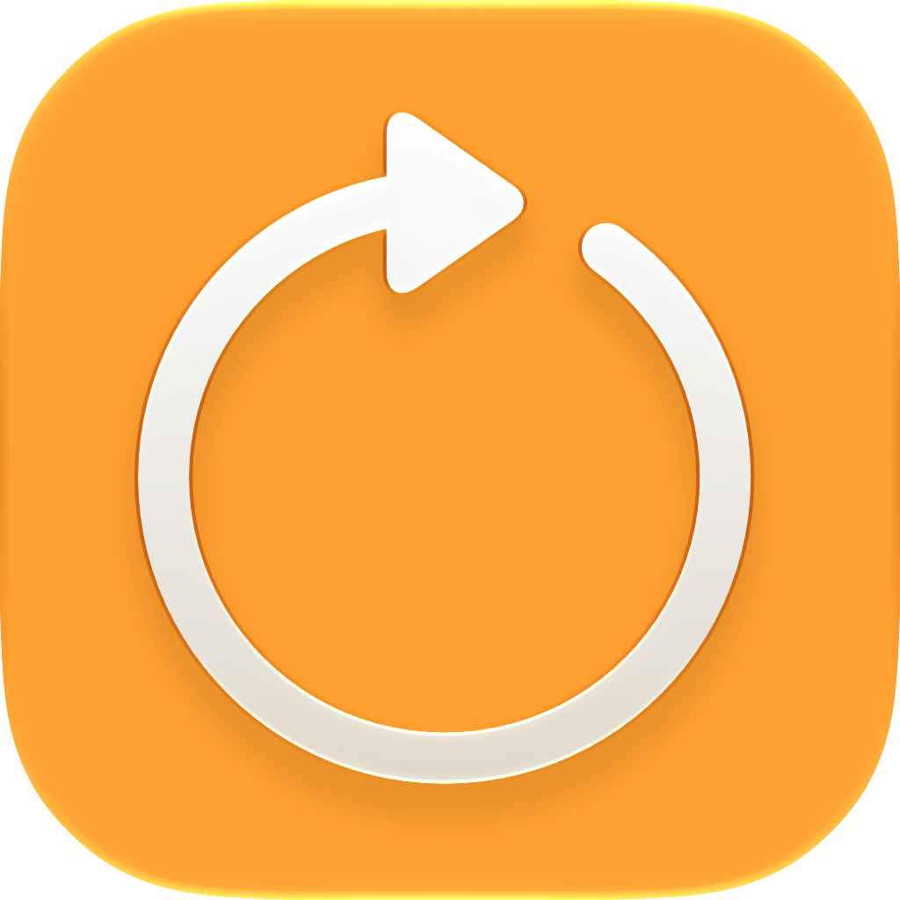
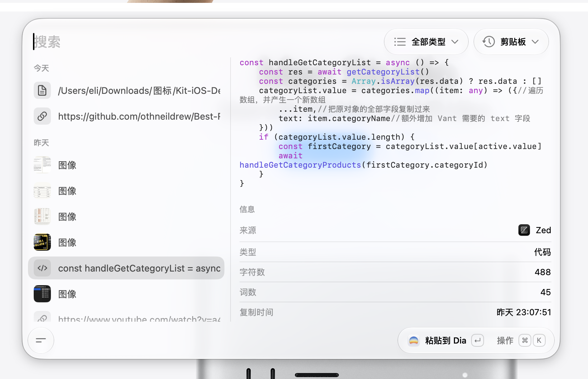

<p align="center">
  
</p>

<h1 align="center">Kit</h1>

<p align="center">
  A native macOS clipboard history tool built for keyboard workflows.<br>
  Capture text, code, links, and images, then search and paste them back into the source app.
</p>

<p align="center">
  <a href="README.md">简体中文</a> ·
  <a href="README.en.md">English</a>
</p>

<p align="center">
  <a href="LICENSE"></a>
  
  
</p>

<p align="center">
  
</p>

## What is Kit?

Kit turns clipboard history into a command palette you can summon whenever you need it. Open the palette, search what you copied, select an item, and paste it back into the app you were using.

## Features

- **Capture everyday content**: Save text, code, links, and images with their source app
- **Find items quickly**: Search the full history with SQLite full-text search, including Chinese Pinyin and initials
- **Stay on the keyboard**: Open the palette, search, select, and paste without leaving your workflow
- **Preview images**: Browse thumbnails and press Space for a larger preview
- **Manage history**: Browse items by date, set a retention period, and exclude apps from capture

## Workflow

Press `Option + W` to show or hide the palette. Type to filter history, move with the arrow keys, and press Return to paste.

| Shortcut | Action |
| --- | --- |
| `Return` | Paste and close the palette |
| `⌘ Return` | Copy the selected item |
| `Space` | Preview an image |

The action menu also lets you paste while keeping the palette open, reveal an image in Finder, or delete an item. You can record a different global shortcut in Settings.

## Privacy and Permissions

Clipboard history and images stay on your Mac; no cloud service is required. Choose how long to keep history and which apps to exclude. Keychain Access and Passwords are excluded by default.

Kit needs Accessibility permission to send the selected content back to the app that was active before the palette opened.

## Build from Source

You need macOS 26, Xcode 27, and Swift 6.4.

```bash
git clone https://github.com/imeelinew/Kit.git
cd Kit
open Kit.xcodeproj
```

In Xcode, select the **Kit** scheme and choose **Product → Run**. Grant Accessibility permission when prompted before the first paste operation.

## License

Kit is distributed under the [GNU Affero General Public License v3.0](LICENSE).
